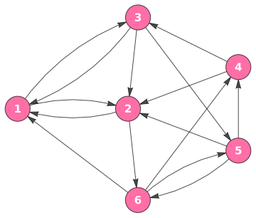

```{r setup, include=FALSE}
knitr::opts_chunk$set(echo = FALSE)
library(sna)
library(seqinr)
library(markovchain)
library(igraph)
```


<script src="https://cdnjs.cloudflare.com/ajax/libs/prism/0.0.1/prism.min.js"></script>

<script src="//cdnjs.cloudflare.com/ajax/libs/highlight.js/10.5.0/highlight.min.js"></script>


## PageRank as a Markov Chain

Sergy Brin and Larry Page developed *PageRank* as a way to rank the importance of a webpage on the internet based on the counted number of links to it. For example, consider the following internet: 


```{r}
caption1 <- "PageRank as a Markov Chain."
```


```{r, out.width="40%", fig.align='center', fig.cap=caption1}

```


$\require{color}\definecolor{teall}{RGB}{58, 171, 174} \definecolor{bluemoon}{RGB}{62, 71, 125} \definecolor{redhot}{RGB}{255, 145, 115} \definecolor{periwinkle}{RGB}{159, 160, 255} \definecolor{purpley}{RGB}{31, 35, 255} \definecolor{gween}{RGB}{73, 175, 129} \definecolor{pinky}{RGB}{251, 109, 134} \definecolor{pinky2}{RGB}{241, 67, 192} \definecolor{maglav}{RGB}{241, 167, 254}$


Let each state be a webpage, and a transition from one state to another is a link from one webpage to another. If a random user is at website $\bf 1$, then there's a $\tfrac{1}{3}$ probability of moving to the websites $\bf 2, 3,$ and $\bf 6$, respectively. The **transition matrix** of the corresponding Markov chain is:


$$
P = 
\mathit{\large\begin{matrix}\bf\color{redhot}1 \\ \bf\color{redhot}2 \\ \bf\color{redhot}3 \\ \bf\color{redhot}4 \\ \bf\color{redhot}5 \\ \bf\color{redhot}6 \end{matrix}}
\begin{pmatrix}0 & \frac{1}{4} & \frac{1}{2} & 0 & 0 & 0\\\frac{1}{3} & 0 & 0 & 0 & 0 & \frac{1}{2}\\\frac{1}{3} & \frac{1}{4} & 0 & 0 & \frac{1}{2} & 0\\0 & \frac{1}{4} & \frac{1}{2} & 0 & 0 & 0\\0 & \frac{1}{4} & 0 & \frac{1}{2} & 0 & \frac{1}{2}\\\frac{1}{3} & 0 & 0 & \frac{1}{2} & \frac{1}{2} & 0\end{pmatrix}
$$


### Regular Stochastic Matrix and Periodicity

First we will show that matrix $P$ is a **regular stochastic matrix** based on the following definitions:

<div class="b3">
<span class="lp1">Definition 1.0. </span> A vector is called a probability vector if its entries are nonnegative and sum to $1$. A matrix is column/row stochastic if and only if its columns/rows are probability vectors.

<span class="lp2">Definition 1.1. </span> A stochastic matrix $P$ is regular if there is some $k \gt 0$ for which all the entries in $P^k$ are positive.

<span class="lp3">Observation. </span> It follows from the definitions that any regular matrix is transitive.
</div>

Matrix $P$ is a nonnegative matrix since every entry $p_{ij}\geq 0$. The columns of matrix $P$ sum to $1$; so, each column is a probability vector and hence the matrix is called **column stochastic**. The matrices $P_n$ are **regular** as seen by observing powers of $P$: *e.g.* for $n = 3$, 
$$
\small
P^3 = \begin{pmatrix}\frac{1}{12} & \frac{1}{8} & \frac{1}{8} & \frac{3}{16} & \frac{1}{16} & \frac{3}{16}\\\frac{1}{12} & \frac{5}{24} & \frac{5}{24} & \frac{1}{8} & \frac{1}{12} & \frac{1}{6}\\\frac{1}{4} & \frac{1}{8} & \frac{1}{6} & \frac{3}{16} & \frac{13}{48} & \frac{5}{48}\\\frac{1}{12} & \frac{1}{8} & \frac{1}{8} & \frac{3}{16} & \frac{1}{16} & \frac{3}{16}\\\frac{1}{6} & \frac{1}{4} & \frac{1}{4} & \frac{3}{16} & \frac{3}{16} & \frac{3}{16}\\\frac{1}{3} & \frac{1}{6} & \frac{1}{8} & \frac{1}{8} & \frac{1}{3} & \frac{1}{6}\end{pmatrix}
$$

which is positive. Hence, there exists $k = 3$ for which all the entries in $P^3$ are positive ($p_{ij} \gt 0$). Hence, $P$ is regular and hence **transitive**. 


Next we will show that matrix $P$ is **aperiodic** based on the following definition:

<div class="b3">
<span class="lp32"> Definition 3.5. </span> Let $A$ be a nonnegative matrix. The $A-\text{periodicity}$ of the index $j$ is the greatest common divisor of all the return times for index $j$; alternatively the $A-\text{periodicity}$ of the index $j$ is the greatest common divisor of all $m\in \mathbb{N}$ with $(A^m)_{jj} \neq 0$. An index $j$ is aperiodic if it has periodicity $1$.
</div>


We will show that each index $j$ with $(P^m)_{jj}$ has periodicity $1$ and hence is aperiodic. Computing the greatest common divisor of all the return times:

$$
\begin{align}
P^2 = 
\begin{pmatrix}
\bf\color{pinky2}{\frac{1}{4}} & \frac{1}{8} & 0 & 0 & \frac{1}{4} & \frac{1}{8} \\ 
\frac{1}{6} & \bf\color{pinky2}{\frac{1}{12}} & \frac{1}{6} & \frac{1}{4} & \frac{1}{4} & 0 \\
\frac{1}{12} & \frac{5}{24} & \bf\color{pinky2}{\frac{1}{6}} & \frac{1}{4} & 0 & \frac{3}{8} \\
\frac{1}{4} & \frac{1}{8} & 0 & \bf\color{pinky2}0 & \frac{1}{4} & \frac{1}{8} \\
\frac{1}{4} & \frac{1}{8} & \frac{1}{4} & \frac{1}{4} & \bf\color{pinky2}{\frac{1}{4}} & \frac{1}{8} \\ 
0 & \frac{1}{3} & \frac{5}{12} & \frac{1}{4} & 0 & \bf\color{pinky2}{\frac{1}{4}}
\end{pmatrix} &&
P^3 =
\begin{pmatrix}
\bf\color{pinky}{\frac{1}{12}} & \frac{1}{8} & \frac{1}{8} & \frac{3}{16} & \frac{1}{16} & \frac{3}{16} \\
\frac{1}{12} & \bf\color{pinky}{\frac{5}{24}} & \frac{5}{24} & \frac{1}{8} & \frac{1}{12} & \frac{1}{6} \\
\frac{1}{4} & \frac{1}{8} & \bf\color{pinky}{\frac{1}{6}} & \frac{3}{16} & \frac{13}{48} & \frac{5}{48} \\
\frac{1}{12} & \frac{1}{8} & \frac{1}{8} & \bf\color{pinky}{\frac{3}{16}} & \frac{1}{16} & \frac{3}{16} \\
\frac{1}{6} & \frac{1}{4} & \frac{1}{4} & \frac{3}{16} & \bf\color{pinky}{\frac{3}{16}} & \frac{3}{16} \\
\frac{1}{3} & \frac{1}{6} & \frac{1}{8} & \frac{1}{8} & \frac{1}{3} & \bf\color{pinky}{\frac{1}{6}}
\end{pmatrix}
\end{align}
$$


1. $P^2_{11} \neq 0$ and $P^3_{11} \neq 0$, so the periodicity of index $1$ is $\gcd(2, 3) = \bf 1$
2. $P^2_{22} \neq 0$ and $P^3_{22} \neq 0$, so the periodicity of index $2$ is $\gcd(2, 3)= \bf 1$
3. $P^2_{33} \neq 0$ and $P^3_{33} \neq 0$, so the periodicity of index $3$ is $\gcd(2, 3)= \bf 1$
4. $P^3_{44} \neq 0$, and $P^4_{44} \neq 0$, so the periodicity of index $4$ is $\gcd(3, 4)= \bf 1$
5. $P^2_{55} \neq 0$ and $P^3_{55} \neq 0$, so the periodicity of index $5$ is $\gcd(2, 3)= \bf 1$
6. $P^2_{66} \neq 0$ and $P^3_{66} \neq 0$, so the periodicity of index $6$ is $\gcd(2, 3)= \bf 1$


Hence, the transition matrix $P$ is transitive and aperiodic.


----------------------

### Steady State Probabilities 


The probability vector gives the probability of a web user arriving at a website after an infinite number of browser moves. This vector should satisfy $P \pi = \pi$; in other words $\pi$ is an eigenvector of $P$ for the eigenvalue $1$. 

<div class="b3">
<span class="lp5">Theorem (Fundamental Theorem of Markov Chains). </span> If $P$ is an $n \times n$ regular stochastic matrix, then $P$ has a unique positive steady-state vector $\vec{q}$. Further, if $\vec{x}_0$ is any initial state and $\vec{x}_{k+1} = P\vec{x}_k$, then over time $\vec{x}_k$ converges to $\vec{q}$ if, in the sense that $\lim \vec{x}_k = \vec{q}$.
</div>

The transition matrix $P$ is a regular stochastic matrix, so the *Fundamental Theorem of Markov Chains* applies. We just need to find the probability vector $\vec{q}$ so that $P\vec{q} = \vec{q}$. The unique probability vector in the eigenspace of $\rho(P) = 1$ is spanned by: $$\vec{\mathbf v} = \begin{bmatrix} \frac{11}{18} & \frac{19}{27} & \frac{47}{54} & \frac{11}{18} & \frac{53}{54} & 1 \end{bmatrix}^{\color{purpley}{\top}}$$

<div class="b3">
<span class="lp6">Frobenius' Theorem. </span> Let $A$ be a nonnegative matrix and $\mathit{III}$ be a matrix of all $1$s. Then $\forall \ m \in \mathbb{N}$, the matrix $A + \frac{1}{m} \mathit{III} \gt 0$. Therefore for each $m$, the matrix $A + \frac{1}{m} \mathit{III}$ has a positive dominant eigenvalue $\rho_m$ with a positive corresponding eigenvector $v_m$. By dividing by the sum of the entries, we may assume each $v_m$ is a probability vector. Consequently, $\rho = \lim_{m\rightarrow \infty}(\rho_m)$ exists and is equal to the spectral radius of $A$, and $\lim_{m\rightarrow \infty}(V_m) = v$ exists such that $v \gneqq 0$ is an eigenvector for the eigenvalue $\rho$.
</div>

Take a scalar multiple of $\vec{\mathrm v}$ to make it a probability vector by letting ${\mathbf c} = {\left(\tfrac{11}{18} + \tfrac{19}{27} + \tfrac{47}{54} + \tfrac{11}{18} + \tfrac{53}{54} + 1\right)}^{-1} = \tfrac{9}{43}$. Then we can calculate the unique positive steady-state vector as:

$$
{\large\color{bluemoon} \vec{\mathbf q}} = {\large\mathrm{c} \times {\bf \vec{v}}}  = 
{\color{purpley} \frac{9}{43}} \times 
{\begin{bmatrix} \ \frac{11}{18}\ \\ \frac{19}{27}\\ \frac{47}{54}\\ \frac{11}{18}\\ \frac{53}{54} \\ 1 \end{bmatrix}} \ \equiv \
{\begin{bmatrix} \frac{11}{86}\\ \frac{19}{129}\\ \frac{47}{258}\\ \frac{11}{86}\\ \frac{53}{258}\\ \frac{9}{43} 
\end{bmatrix}} \equiv 
\small \begin{bmatrix}0.1279 \\ 0.1473 \\ 0.1822 \\ 0.1279 \\ 0.2054 \\ 0.2093 \end{bmatrix}
$$

Hence, the unique positive steady-state vector is $\vec{\mathbf q} \equiv \begin{bmatrix}0.1279 & 0.1473 & 0.1822 & 0.1279 & 0.2054 & 0.2093 \end{bmatrix}^{\mathbf \top}$. In general, a Markov chain with an irreducible and ergodic transition matrix has $\lambda = 1$ to be the largest eigenvalue, and its corresponding unique eigenvector is $\pi$. In addition, both the algebraic and geometric multiplicity of $\lambda = 1$ equals $1$. 


--------------------


## Transitive and Aperiodic Matrices

**<span class="sp12">1. </span> Show that the following matrix is transitive and aperiodic.**

Let matrix $$A = {\begin{matrix}\bf\color{navy}1 \\ \bf\color{navy}2 \\ \bf\color{navy}3 \\ \bf\color{navy}4 \\ \bf\color{navy} 5 \end{matrix}} \begin{pmatrix}0 & 2 & 0 & 0 & 3\\0 & 0 & 4 & 0 & 0\\0 & 0 & 0 & 2 & 0\\0 & 8 & 0 & 0 & 6\\4 & 0 & 0 & 0 & 0\end{pmatrix}.$$ 


<div class="b3">
<span class="lp7">Definition 3.2. </span> Let $A$ be a nonnegative $n\times n$ matrix. We say that $A$ connects $j$ to $i$ directly if $a_{ij}\neq 0$, and we say that $A$ connects $j$ to $i$ if for some $k, A^k$ connects $j$ to $i$ directly. We say that $A$ is transitive if for every pair $(i,j)$, $A$ connects $i$ to $j$.
</div>
Observe that for row $1$, there are nonzero entries for $a_{12}$ and $a_{15}$, which means we can trace vertex $\bf 1$ to vertex $\bf 2$ and vertex $\bf 5$ as follows: $\bf (1) \longrightarrow (2)$ and $\bf (1) \longrightarrow (5)$. Similarly, for row $2$ there is a nonzero entry for $a_{23}$ which means we can trace vertex $\bf 2$ to vertex $\bf 3$. Row $3$ has a nonzero entry for $a_{34}$ which means we can trace vertex $\bf 3$ to vertex $\bf 4$. Row $4$ has nonzero entries for $a_{42}$ and $a_{45}$ which means we can trace vertex $\bf 4$ to vertex $\bf 2$ and vertex $\bf 4$ to vertex $\bf 5$ as follows. Lastly, row $5$ has a nonzero entry for $a_{51}$ which means we can trace vertex $\bf 5$ to vertex $\bf 1$. Thus, all of the edges connecting these vertices is as follows: $\left\{\bf (1) \longrightarrow (2)\right\}$, $\left\{\bf (1) \longrightarrow (5)\right\}$, $\left\{\bf (2) \longrightarrow (3)\right\}$, $\left\{\bf (3) \longrightarrow (4)\right\}$, $\left\{\bf (4) \longrightarrow (2)\right\}$, $\left\{\bf (4) \longrightarrow (5)\right\}$, and $\left\{\bf (5) \longrightarrow (1)\right\}$. 

```{r}
caption2 <- "Markov chain is said to be aperiodic if its period is 1, and periodic otherwise."
```


```{r, out.width="35%", fig.align='center', fig.cap=caption2}

```


The matrix $A$ is **aperiodic** if each index $j$ with $(A^m)_{jj}$ has periodicity $1$. Computing the greatest common divisor of all the return times:


1. $P^4_{11} \neq 0$ and $P^5_{11} \neq 0$, so the periodicity of index $1$ is $\gcd(4, 5) = \bf 1$
2. $P^5_{22} \neq 0$ and $P^6_{22} \neq 0$, so the periodicity of index $2$ is $\gcd(5, 6)= \bf 1$
3. $P^5_{33} \neq 0$ and $P^6_{33} \neq 0$, so the periodicity of index $3$ is $\gcd(5, 6)= \bf 1$
4. $P^5_{44} \neq 0$, and $P^6_{44} \neq 0$, so the periodicity of index $4$ is $\gcd(5, 6)= \bf 1$
5. $P^4_{55} \neq 0$ and $P^5_{55} \neq 0$, so the periodicity of index $5$ is $\gcd(4, 5)= \bf 1$


Hence, the transition matrix $P$ is transitive and aperiodic.


Next, divide each entry by the sum of the entries in its row in order to get each row of the matrix to sum to $1$:

$$
\small
P = \begin{pmatrix}0 & \frac{2}{2 + 3} & 0 & 0 & \frac{3}{2 + 3}\\0 & 0 & \frac{4}{4} & 0 & 0\\0 & 0 & 0 & \frac{2}{2} & 0\\0 & \frac{8}{8 + 6} & 0 & 0 & \frac{6}{8 + 6}\\\frac{4}{4} & 0 & 0 & 0 & 0\end{pmatrix} \equiv
\begin{pmatrix}0 & \frac{2}{5} & 0 & 0 & \frac{3}{5}\\0 & 0 & 1 & 0 & 0\\0 & 0 & 0 & 1 & 0\\0 & \frac{8}{14} & 0 & 0 & \frac{6}{14}\\ 1 & 0 & 0 & 0 & 0\end{pmatrix} \equiv
\begin{pmatrix}
0 & .4 & 0 & 0 & .6 \\
0 & 0 & 1 & 0 & 0 \\ 
0 & 0 & 0 & 1 & 0 \\ 
0 & .57 & 0 & 0 & .43 \\ 
1 & 0 & 0 & 0 & 0 \\ 
\end{pmatrix}
$$


and hence the matrix $P$ is **row stochastic**. 
 

```{r, out.width="70%"}
# convert matrix to stochastic matrix
matrix1 <- matrix(c(0,0,0,0,4, 2,0,0,8,0, 0,4,0,0,0, 0,0,2,0,0, 3,0,0,6,0), nrow = 5)
matrix2 <- (make.stochastic(matrix1, mode = "row"))

# generate markov transition diagram 
alphInit<-c('1', '2','3','4', '5')
markovTransitionMat <- new("markovchain", states = alphInit, transitionMatrix = matrix2)
#plot(markovTransitionMat, curved = TRUE, main = "Transition Diagram", loop.angle = 0.5)

```


--------------------

### References

