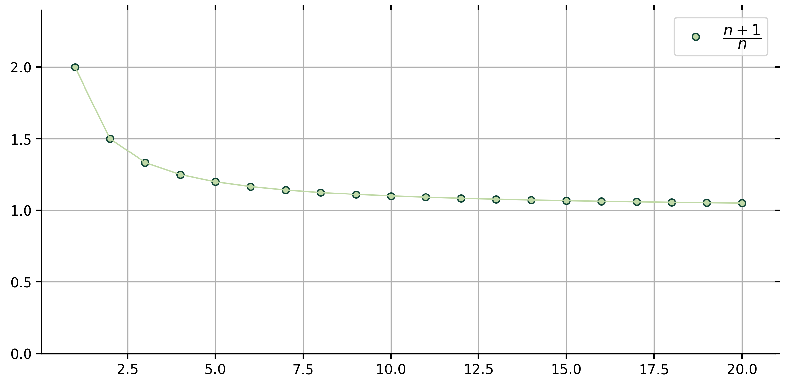

<script src="https://cdnjs.cloudflare.com/ajax/libs/prism/0.0.1/prism.min.js"></script>

<script src="//cdnjs.cloudflare.com/ajax/libs/highlight.js/10.5.0/highlight.min.js"></script>


## Convergence of a Sequence

<span class="lp12">Definition. (Sequence Convergence) </span> A sequence $(a_n)$ converges to a real number $a$ if, for every positive number $\epsilon$, there exists an $N \in \mathbb N$ such that whenever $n \geq N$ it follows that $\left|a_n − a\right| \lt \epsilon$. 

In the following, we will determine whether a given sequence converges to a certain limit, and then we'll use `Python` to illustrate the sequence graphically. The method is to compute and plot the first $20$ values of the given sequence, which can be done using the following `Python` libraries: 

```language-python
## import sympy
from sympy import limit_seq
from sympy.abc import n
```


-----

### <span class="sp10">1. </span> Show that $\lim\limits_{n\rightarrow\infty}\left(\frac{n+1}{n}\right) \equiv 1$.

<div class="b45">
We want to prove the inequality $\left|a_n − a\right| \lt \epsilon$ for the sequence $a_n \equiv \frac{n+1}{n}\ $ and $a\equiv1$.


<span class="lp11"><span class="prf"> Proof. </span></span> Let $\epsilon \gt 0 \ $ be arbitrary. Choose $N \in \mathbb N \ $ with $N \gt \frac{1}{\epsilon}$. To verify that this choice of $N$ is appropriate, let $n \in \mathbb N$ satisfy $n \geq N$. Then $n \gt \frac{1}{\epsilon}\ $, which is the same as saying $\frac{1}{n} \lt \epsilon$. Hence, this means

$$\begin{align} \left|\frac{n+1}{n}-1\right| \equiv \left|\frac{(n+1) - n}{n}\right| \equiv \frac{1}{n} \lt \epsilon .\end{align}$$ 

So by the definition of convergence, $\lim\limits_{n\to \infty}{\frac{n+1}{n}} \equiv 1$.


<span class="lp11"><span class="cody">Python Code. </span></span>

```language-python
## compute the sequence limit
a = (n + 1)/n
L = limit_seq(a, n)
print("The sequence converges to:", L)

## compute sequence terms
nvals = range(1, 21) 
a_20 = [a.subs({n:i}) for i in nvals]

## plot sequence
fig, ax = plt.subplots(figsize = (5, 4))
plt.plot(nvals, a_20, 'o') 
```


```{r echo=FALSE, warning=FALSE, include=FALSE}
cap_1 <- "Observe that as $n$ tends to $\\infty$, the sequence $a_n \\equiv \\frac{(n + 1)}{n}$ approaches $1$."
```


```{r echo=FALSE, fig.align='default', out.width=600, fig.cap=cap_1}

```

</div>


----------------------------


### <span class="sp4">2. </span> Verify that the following sequences converge to the proposed limit.

**<span class="lp4">$\;$ (a) </span> $\displaystyle \mathbf{\lim_{n \to \infty}{\frac{2n+1}{5n+4}} \equiv \frac{2}{5}}$**

<div class="b45">
We want to prove the inequality $\left|a_n − a\right| \lt \epsilon$ for the sequence $a_n \equiv \frac{2n+1}{5n+4}\ $ and $a\equiv\frac{2}{5}$.


<span class="lp5"><span class="prf"> Proof. </span></span> Let $\epsilon \gt 0 \ $ be arbitrary. Choose $N \in \mathbb N \ $ with $N \gt \frac{3 - 20 \epsilon}{25 \epsilon}$. To verify that this choice of $N$ is appropriate, let $n \in \mathbb N$ satisfy $n \geq N$. Then $n \gt \frac{3 - 20 \epsilon}{25 \epsilon}\ $, which is the same as saying $\frac{3}{5 \left(5 n + 4\right)} \lt \epsilon$. Hence, this means

$$\begin{align} \left|\frac{2n+1}{5n+4} - \frac{2}{5} \right|  \equiv  \frac{\left|5\left(2n+1\right)-2\left(5n+4\right)\right|}{5\left(5n+4\right)} \equiv \frac{3}{5\left(5n+4\right)}\ \lt \epsilon .\end{align}$$

So by the definition of convergence, $\lim\limits_{n\to \infty}{\frac{2n+1}{5n+4}} \equiv \frac{2}{5}$.

<span class="lp5"><span class="cody">Python Code. </span></span>

```language-python
## define sequence
a = (2*n + 1) / (5*n + 4)
L = limit(abs(a), n, oo) # alternating series test
print('The limit is', L)

## plot sequence
nvals = range(1, 81)
a_80 = [abs(a.subs({n:i})) for i in nvals]
fig, ax = plt.subplots(figsize = (6, 4))
plt.plot(nvals, a_80, linewidth = 1, color = '483d8b')
plt.plot(nvals, a_80, 'o', color = '8996d4', markeredgecolor = '483d8b')
```


```{r echo=FALSE, warning=FALSE, include=FALSE}
cap_2 <- "Observe that as $n$ tends to $\\infty$, the sequence $a_n \\equiv \\frac{2n+1}{5n+4}$ approaches $\\frac{2}{5} \\equiv 0.40$."
```


```{r, out.width=600, echo=FALSE, fig.align='default', fig.cap=cap_2}
knitr::include_graphics("Plot2.png")
```

</div>


--------------------


**<span class="lp7">$\;$ (b) </span> $\displaystyle \mathbf{ \lim_{n \to \infty}{\frac{2n^2}{n^3+3}} \equiv 0}$** 

<div class="b45">
We want to prove the inequality $\left|a_n − a\right| \lt \epsilon$ for the sequence $a_n \equiv \frac{2n^2}{n^3+3}\ $ and $a\equiv0$.


<span class="lp8"><span class="prf"> Proof. </span></span> Let $\epsilon \gt 0 \ $ be arbitrary. Choose $N \in \mathbb N \ $ with $N \gt \frac{3}{\epsilon}$. To verify that this choice of $N$ is appropriate, let $n \in \mathbb N$ satisfy $n \geq N$. Then, $n \geq N$ implies $n \gt \frac{3}{\epsilon}\ $, which is the same as saying $\frac{3}{n} \lt \epsilon$. Hence, this means 

$$\begin{align}\left|\frac{2n^2}{n^3+3} - 0 \right|  \equiv  \frac{2n^2}{n^3 + 3} \leq \frac{2}{n+\frac{3}{n^2}} \lt \frac{3}{n} \lt \epsilon .\end{align}$$

So by the definition of convergence, $\lim\limits_{n\to \infty}{\frac{2n^2}{n^3 + 3}} \equiv 0$. 


<span class="lp8"><span class="cody">Python Code. </span></span>

```language-python
## define sequence
a = (2*n**2) / (n**3 + 3)
L = limit(abs(a), n, oo) # alternating series test
print('The limit is', L)

## plot sequence
nvals = range(1, 81)
a_80 = [abs(a.subs({n:i})) for i in nvals]
fig, ax = plt.subplots(figsize = (6, 4))
plt.plot(nvals, a_80, linewidth = 1, color = '483d8b')
plt.plot(nvals, a_80, 'o', color = '8996d4', markeredgecolor = '483d8b')
```


```{r echo=FALSE, warning=FALSE, include=FALSE}
cap_3 <- "Observe that as $n$ tends to $\\infty$, the sequence $a_n \\equiv \\frac{2n^2}{n^3+3}$ approaches $0$."
```

```{r, out.width=600, echo=FALSE, fig.align='default', fig.cap=cap_3}
knitr::include_graphics("Plot3.png")
```

</div>


------------------------------

### References


